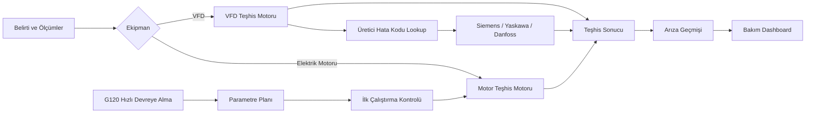

<div align="center">

# ⚡ Akıllı Arıza Teşhis Sistemi

**Endüstriyel bakım için açıklanabilir arıza teşhisi, doğrulanmış VFD hata kodları ve Siemens SINAMICS G120 devreye alma rehberi.**

[](https://react.dev/)
[](https://www.typescriptlang.org/)
[](https://vite.dev/)
[](https://smart-fault-diagnosis.vercel.app/)
[](https://github.com/menes97/smart-fault-diagnosis)

### 🌐 [Canlı Uygulamayı Aç](https://smart-fault-diagnosis.vercel.app/)

</div>

---

## 🎯 Proje nedir?

Akıllı Arıza Teşhis Sistemi; bakım personelinin farklı dokümanlar ve ekranlar arasında dolaşmadan **belirti + ölçüm + üretici hata kodu** verilerini birlikte değerlendirmesine yardımcı olan bir saha destek uygulamasıdır.

Uygulamanın temel yaklaşımı **serbest AI tahmini yapmak yerine deterministik ve açıklanabilir kurallar kullanmaktır.** Her teşhiste yalnızca sonuç değil, sonucun **neden eşleştiği** de gösterilir.

### Öne çıkan kullanım senaryoları

| Modül | Ne yapıyor? |
|---|---|
| ⚙️ Elektrik Motoru Teşhisi | Akım, faz, gerilim, titreşim, sıcaklık ve belirtilerden olası arızaları sıralar |
| 🔌 VFD Teşhisi | DC bara, akım, sıcaklık, frekans ve VFD belirtilerini değerlendirir |
| 📚 Bilgi Bankası | Doğrulanmış Siemens / Yaskawa / Danfoss hata kodlarını aratır |
| ⚡ G120 Hızlı Devreye Alma | Motor etiketinden adım adım SINAMICS G120 parametre planı üretir |
| 🧭 İlk Çalıştırma Kontrolü | Devreye alma sonrası kontrol ve gözlem akışı sunar |
| 🕘 Arıza Geçmişi | Kaydedilmiş teşhisleri tekrar açar ve güncel kurallarla yeniden analiz eder |
| 📊 Bakım Dashboard | Geçmiş teşhislerden bakım istatistikleri üretir |

---

## 🧩 Uygulama akışı



---

## 🛠️ Elektrik motoru arıza teşhisi

Üç fazlı asenkron motorlar için belirtiler ve ölçümler birlikte değerlendirilir.

Desteklenen örnek teşhisler:

- Mekanik aşırı yük
- Mekanik sıkışma
- Rulman problemi
- Faz kaybı
- Faz akımı dengesizliği
- Motor sargı problemi
- Kontaktör / elektriksel bağlantı problemi
- Besleme gerilim problemi
- Yanlış yıldız / üçgen bağlantısı

Sistem, sonuçların altında **“Neden eşleşti?”** bölümünde puana katkı yapan kanıtları gösterir.

> Teşhis puanları olasılık değildir; kural tabanlı **eşleşme skorlarıdır**.

---

## 🔌 VFD / Frekans Konvertörü Teşhisi

Genel VFD belirtileri ve ölçümleri için kural tabanlı değerlendirme içerir.

Örnek kategoriler:

- Aşırı akım
- DC bara aşırı gerilimi
- Düşük besleme / DC bara gerilimi
- Sürücü aşırı sıcaklığı
- Motor aşırı yükü
- Haberleşme problemi
- Hız referansı problemi
- Sürücü hazır değil

DC bara değerlendirmesi **230 V, 400 V ve 480 V** sürücü sınıflarına göre yapılabilir.

---

## ✅ Doğrulanmış üretici hata kodları

V1'de şu sürücü aileleri desteklenmektedir:

| Üretici | Seri / Model ailesi |
|---|---|
| Siemens | SINAMICS G120 |
| Yaskawa | V1000 |
| Danfoss | VLT AutomationDrive FC 302 |

Bilinen üretici kodları **normalize edilmiş exact matching** ile değerlendirilir. Bilinmeyen kodlar için uygulama anlam **uydurmaz**.

Siemens G120 kayıtlarında uygun hata kodları için ayrıca:

- ilgili parametreler,
- Türkçe açıklamalar,
- güvenli kontrol önerileri,
- resmi Siemens doküman bağlantıları

gösterilir.

Örnek aramalar:

```text
F07900
f79
motor bloke
p2175
DC bara
```

---

## ⚡ Siemens SINAMICS G120 Hızlı Devreye Alma

### V1 kapsamı

- Siemens SINAMICS G120
- CU240B-2 / CU240E-2 ailesi
- IEC asenkron motor
- Manuel / BOP-2 rehberli devreye alma

### Wizard akışı

```text
1. Sürücü bilgileri
        ↓
2. Motor etiket bilgileri
        ↓
3. Uygulama / kumanda yöntemi
        ↓
4. Hız ve rampalar
        ↓
5. Motor Identification koşulları
        ↓
6. G120 Parametre Planı
        ↓
7. İlk Çalıştırma Kontrolü
```

### Örnek parametreler

| Parametre | İşlev |
|---|---|
| `p0010` | Hızlı devreye alma filtresi |
| `p0100` | IEC / NEMA standardı |
| `p0300` | Motor tipi |
| `p0304` | Motor nominal gerilimi |
| `p0305` | Motor nominal akımı |
| `p0307` | Motor nominal gücü |
| `p0308` | Motor cos φ |
| `p0310` | Motor nominal frekansı |
| `p0311` | Motor nominal hızı |
| `p1080 / p1082` | Minimum / maksimum hız |
| `p1120 / p1121` | Hızlanma / yavaşlama rampaları |
| `p1900` | Motor Identification |
| `p3900` | Hızlı devreye alma tamamlama |

### G120 modülündeki ek kontroller

- ✅ Y/Δ motor etiketi tutarlılık kontrolü
- ✅ 0–10 V analog hız referansı
- ✅ 4–20 mA analog hız referansı
- ✅ PROFINET / PLC temel rehberi
- ✅ Standard Telegram 1 — PZD 2/2 açıklaması
- ✅ Motor Identification güvenlik akışı
- ✅ İlk çalıştırmada izlenecek G120 değerleri
- ✅ İlk çalıştırmadan motor teşhisine veri aktarımı

---

## 🧠 Teşhis yaklaşımı

Uygulamanın kural motorunda üç temel prensip vardır:

1. **Ölçüm verisi, genel belirti seçimlerinden daha güçlü kanıttır.**
2. **İşaretlenmemiş belirti, ters durumun doğru olduğu anlamına gelmez; bilinmeyen kabul edilir.**
3. **Boş ölçüm ile gerçek `0` değeri birbirinden ayrılır.**

Bu yaklaşım sayesinde kullanıcı yalnızca bir sonuç değil, o sonuca giden kanıtları da görebilir.

---

## 🕘 Arıza Geçmişi ve 📊 Dashboard

Teşhisler kullanıcı isterse tarayıcının `localStorage` alanına kaydedilir.

### Arıza Geçmişi

- Ayrıntıları görüntüleme
- Kayıt arama ve filtreleme
- Yeniden açma
- Güncel kurallarla tekrar analiz etme
- Tek kayıt silme
- Tüm geçmişi temizleme

### Dashboard

Geçmiş kayıtlardan otomatik olarak:

- toplam teşhis sayısı,
- motor / VFD dağılımı,
- doğrulanmış üretici kodu sayısı,
- son teşhisler,
- en sık karşılaşılan arızalar,
- VFD üretici dağılımı

hesaplanır.

> V1'de geçmiş kayıtları yalnızca kullanılan tarayıcıda saklanır; cihazlar arasında senkronize edilmez.

---

## 🧱 Teknoloji yığını

```text
Frontend        React + TypeScript
Build Tool      Vite
Styling         CSS
Persistence     Browser Local Storage
Version Control Git + GitHub
Deployment      Vercel
```

V1 kapsamında backend veya harici veritabanı kullanılmamaktadır.

---

## 🚀 Yerel geliştirme

### Gereksinimler

- Node.js
- npm
- Git

```bash
git clone https://github.com/menes97/smart-fault-diagnosis.git
cd smart-fault-diagnosis
npm install
npm run dev
```

Production build:

```bash
npm run build
```

---

## 🔒 Güvenlik yaklaşımı

Bu uygulama **eğitim ve bakım rehberliği amacıyla** geliştirilmiştir.

- Canlı elektrik tesisatında çalışma talimatı vermez.
- Koruma ve Safety Integrated fonksiyonlarının bypass edilmesini önermez.
- STO / PROFIsafe gibi güvenlik fonksiyonlarının yerine geçmez.
- Sürücüye otomatik parametre yazmaz veya gerçek ekipmanı kontrol etmez.
- Parametre ve bağlantılar sahada yetkili personel tarafından üretici dokümantasyonuna göre doğrulanmalıdır.

> ⚠️ Motor Identification ve ilk çalıştırma sırasında motor veya bağlı mekanizma hareket edebilir. Çalışma alanı güvenli hale getirilmeden test yapılmamalıdır.

---

## 📌 V1 sınırlamaları

- Kullanıcı hesabı yoktur.
- Bulut tabanlı geçmiş senkronizasyonu yoktur.
- Sürücüye doğrudan bağlantı / parametre yazma yoktur.
- G120 hızlı devreye alma rehberi yalnızca tanımlanan V1 kapsamı için tasarlanmıştır.
- Üretici hata kodu veritabanı seçili doğrulanmış kayıtlarla sınırlıdır.

---

## 🗺️ Yol haritası

- [ ] Yaskawa V1000 hızlı devreye alma rehberi
- [ ] Danfoss VLT hızlı devreye alma rehberi
- [ ] G120 doğrulanmış hata kodu kapsamını genişletme
- [ ] Bulut tabanlı kullanıcı hesabı ve teşhis geçmişi
- [ ] Motor etiket fotoğrafından veri çıkarma
- [ ] Gelişmiş bakım raporları
- [ ] Mobil kullanım iyileştirmeleri

---

<div align="center">

## 🌐 Canlı Demo

### https://smart-fault-diagnosis.vercel.app/

**Smart Fault Diagnosis V1 — Industrial Maintenance & Automation Portfolio Project**

</div>
